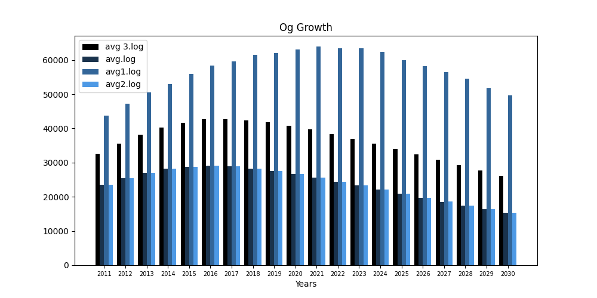

Graph Visualization
===================

The graph visualization produces average value graph images for each parameter (Breed, Spread, Road, etc.) from the data produced from the calibration phase of DSLEUTH.

Input Files for Graph Visualization
-----------------------------------

The folder :code:`graph_avg_log` contains the output data from DSLEUTH needed to run the graph visualization.  The log files include yearly data for each parameter.

Running Graph Visualization
---------------------------

Running :code:`py -m graph_avg_log -input inputFolder` in the :code:`src` directory will use the DSLEUTH input logs provided in :code:`inputFolder` to produce graph image files in the current directory.  Running :code:`py -m graph_avg_log -input avg_log_files/` will run the visualization tool on the sample logs provided in the :code:`avg_log_files` directory.

