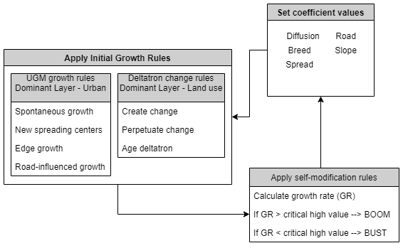

.. _structure:

*********
Structure
*********
| :ref:`structure_gc`: The basic unit of model growth
| :ref:`structure_bs`: A simulation is made up of a series of growth cycles. From start to stop these actions are always executed, regardless of mode.

| Each mode has variations on how simulations are executed.
| :ref:`structure_test`: process flow for test mode
| :ref:`structure_calibrate`: process flow for calibration mode
| :ref:`structure_predict`: process flow for predction mode

.. _structure_gc:

Growth Cycle
------------

A growth cycle is the basic unit of SLEUTH execution. It begins by setting each of the coefficients to a unique value. 
Each of the growth rules are then applied. Finally, the resulting growth rate is evaluated. If the growth rate exceeds or 
falls short of the CRITICAL_HIGH or CRITICAL_LOW values, model self-modification is applied. Self-modification will slightly alter 
the coefficient values to simulate accelerated or depressed growth that is related with boom and bust conditions in urban development.

.. _structure_bs:

Basic Simulation
----------------
A simulation is a step up in complexity from a growth cycle. A simulation is a series of growth cycles that begins at a start date 
and completes at a stop date.

Inital Conditions
"""""""""""""""""

A simulation must be initialized with a set of conditions. These initial conditions are a) an integer value, or seed, that initializes 
the random number generator b) a value for each of the five growth coefficients and c) SLEUTH input images most closely representing the 
start date. With these initial conditions growth cycles are generated.

Growth Cycles
"""""""""""""

It is assumed that one growth cycle represents a year of growth. Following this assumption: 

	*number of growth cycles in a simulation = stop_date - start_date*
	

When the required number of growth cycles has been generated, the simulation concludes.

.. _structure_test:

Test Mode Process Flow
----------------------
Test mode was created as a way to generate a set of historical data simulations, such as those described in calibration mode process flow, 
for a single coefficient set without requiring the START and STOP coefficients to be set to identical values. Only the START values are used 
when testing. The START value must be greater than the STOP value.

Test mode can produce the same statistic and image files that may be generated in calibrate mode. Additionally, on the final Monte Carlo run, 
test mode will generate annual images of land cover change. In this way, a visual and further statistical evaluation of calibration coefficient 
performance may be made.

Inital Conditions
"""""""""""""""""

Each simulation in a test mode is initialized with the START values of each coefficient type and SLEUTH images as described in a basic simulation. 
The seed value for the first simulation is initialized with the RANDOM_SEED flag. After a simulation is completed, the initializing seed that began 
that simulation is reset and a new simulation is run. This process continues MC number of times.

Growth Cycles
"""""""""""""

It is assumed that one growth cycle represents a year of growth. Following this assumption: 

	*number of growth cycles in a simulation = stop_date - start_date*
	

When the required number of growth cycles has been generated, the simulation concludes.

.. _structure_calibrate:

Calibration Mode Process Flow
-----------------------------
Calibration is the most complex of the different mode types. Each coefficient set combination created by the coefficient START, STOP and STEP values 
will initialize a run (R). Each run will be executed MONTE_CARLO_ITERATIONS number of times. The RANDOM_SEED value initializes the first monte carlo 
simulation of every run.

The run initializing seed value is set in the scenario file with the RANDOM_SEED flag. The number of monte carlo iterations is set in the scenario file 
using the MONTE_CARLO_ITERATION flag. Coefficient sets are defined in the scenario file with the CALIBRATION_* flags, where "*" indicates a coefficient type.

Several statistic (_.log) and image files may be generated in calibrate mode by setting preferences in the scenario file. However, due to the computational 
requirements of calibration, it is recommended that these write flags are set to OFF. Instead, once a few top coefficient sets are identified, statistics and 
image files for these runs may be generated in test mode. For a description of mode output see the :ref:`data` page.

Inital Conditions
"""""""""""""""""

Each run of a calibration job is initialized with a permutation of the coefficient ranges. Each run will be executed MONTE_CARLO_ITERATIONS number of times. 
The first monte carlo of each run is initialized with the RANDOM_SEED value. After a simulation is completed, the initializing seed that began that simulation 
is reset and a new monte carlo simulation is run. This process continues MC number of times. When the number of monte carlo iterations for that run has been 
completed, a coefficient value will be incremented and a new run initialized. This will continue until all possible coefficient permutations have been completed.

Generated Simulations
"""""""""""""""""""""

It is assumed that one growth cycle represents a year of growth. Following this assumption: 

	*number of growth cycles in a simulation = stop_date - start_date*

As growth cycles (or years) complete, time passes. When a cycle completes that has a matching date from the urban input layers, a gif image of simulated data is 
produced and several metrics of urban form are measured and stored in memory. When the required number of monte carlo simulations has been completed the 
measurements for each metric are averaged over the number of monte carlo iterations. These averaged values are then compared to the input urban 
data, and Pearson regression scores are calculated for that run. These scores are written to the control_stats.log file and used to assess coefficient set 
performance.

When the required number of growth cycles has been generated, the simulation concludes.

.. _structure_predict:

Predict Mode Process Flow
-------------------------
Prediction mode is a collection of Monte Carlo simulations. The coefficient set and initial images for a prediction run are identical for every simulation, 
but the initializing seed value is altered a MONTE_CARLO_ITERATION (MC) number of times, with each simulation evolving slightly differently due to the modified 
random number series.

The first seed value is set in the scenario file with the RANDOM_SEED flag. The number of Monte Carlo iterations is set in the scenario file using the 
MONTE_CARLO_ITERATION flag. The coefficient set is defined in the scenario file with the PREDCTION_*_BEST_FIT flag, where "*" indicates a coefficient type. 
For a description of prediction mode output see the :ref:`data` page.

Inital Conditions
"""""""""""""""""

Each simulation in a prediction run is initialized with the PREDCITION_*_BEST_FIT coefficient set and SLEUTH images as described in a :ref:`structure_bs`. 
The seed value for the first simulation is initialized with the RANDOM_SEED flag. After a simulation is completed, the initializing seed that began that 
simulation is reset and a new simulation is run. This process continues MC number of times.

Growth Cycles
"""""""""""""

It is assumed that one growth cycle represents a year of growth. Following this assumption: 

	*number of growth cycles in a simulation = stop_date - start_date*
	

When the required number of growth cycles has been generated, the simulation concludes.

